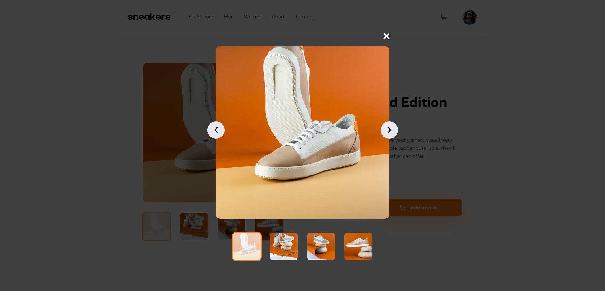
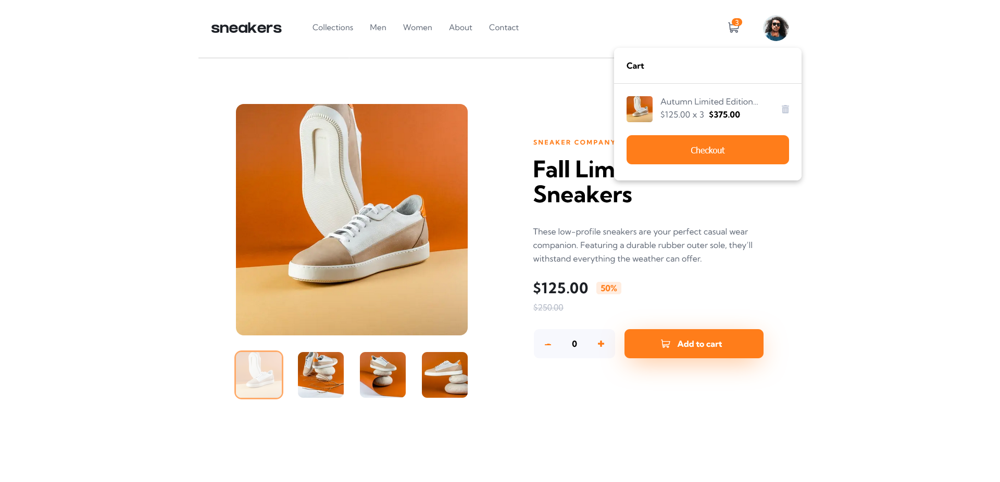
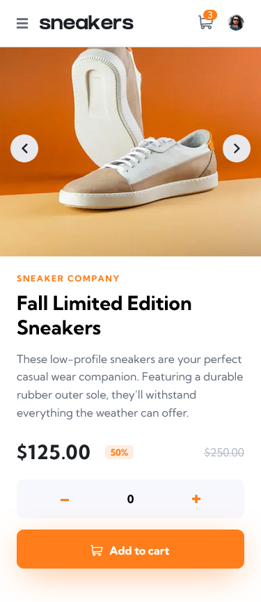
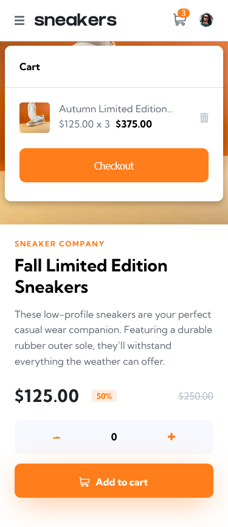

# Frontend Mentor - REST Countries API with color theme switcher solution

This is a solution to the [E-commerce product page challenge on Frontend Mentor](https://www.frontendmentor.io/challenges/ecommerce-product-page-UPsZ9MJp6). Frontend Mentor challenges help you improve your coding skills by building realistic projects.

## Table of contents

- [Overview](#overview)
  - [The challenge](#the-challenge)
  - [Screenshot](#screenshot)
  - [Links](#links)
- [My process](#my-process)
  - [Built with](#built-with)
  - [What I learned](#what-i-learned)

### The challenge

Users should be able to:

- View the optimal layout for the site depending on their device's screen size
- See hover states for all interactive elements on the page
- Open a lightbox gallery by clicking on the large product image
- Switch the large product image by clicking on the small thumbnail images
- Add items to the cart
- View the cart and remove items from it

### Screenshots

Desktop

Mobile

### Links

- Solution URL: [repo](https://github.com/fayax555/ecommerce-product-page)
- Live Site URL: [live](https://ecommerce-product-page.vercel.app/)

## My process

### Built with

- Semantic HTML5 markup
- Flexbox
- CSS Grid
- Mobile-first workflow
- [React](https://reactjs.org/) - JS library.
- [Next.js](https://nextjs.org/) - React framework.
- [TypeScript](https://www.typescriptlang.org/) - JavaScript with syntax for types.
- [Stitches](https://stitches.dev/) - For styles.
